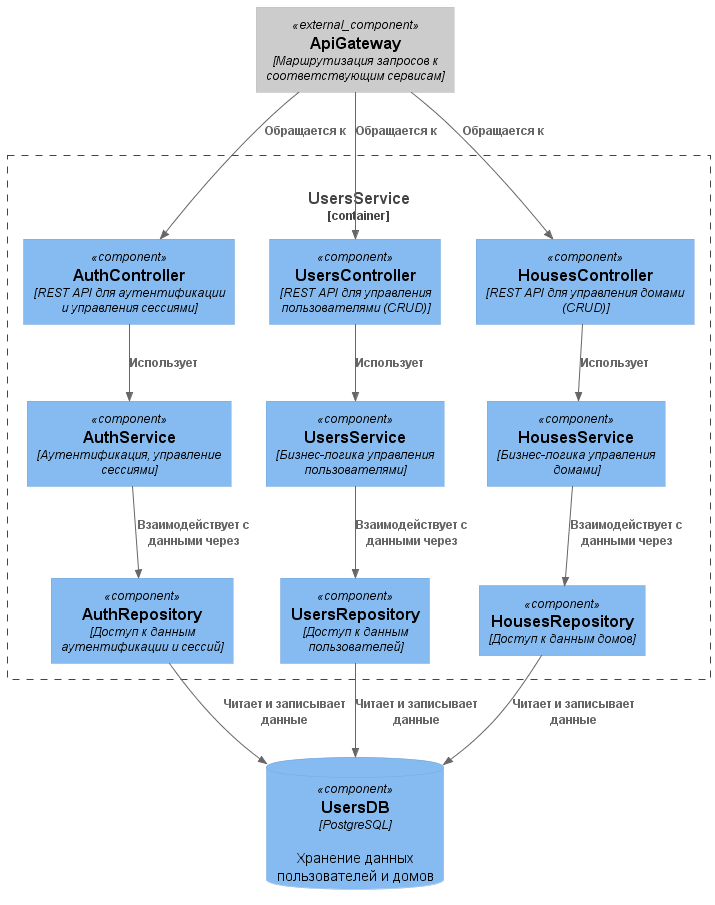
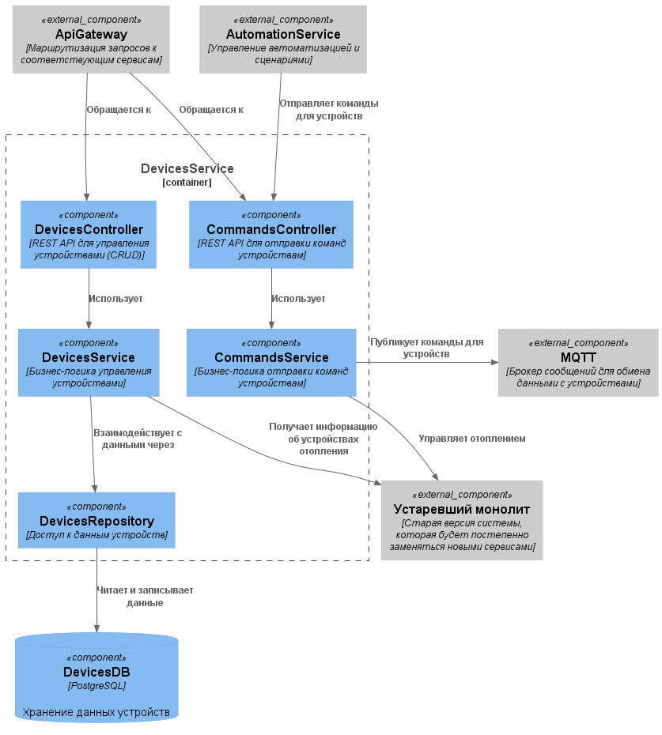
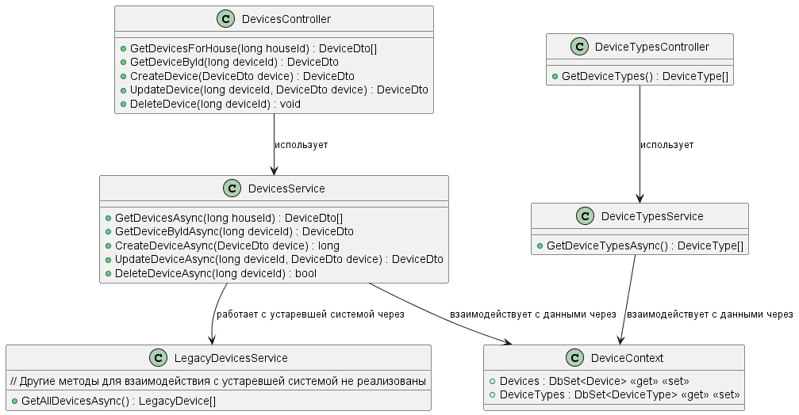

# Smart Home — Микросервисная архитектура

## Содержание

- [Задание 1. Анализ и планирование](#задание-1-анализ-и-планирование)
- [Задание 2. Проектирование микросервисной архитектуры](#задание-2-проектирование-микросервисной-архитектуры)
- [Задание 3. Разработка ER-диаграммы](#задание-3-разработка-er-диаграммы)
- [Задание 4. Создание и документирование API](#задание-4-создание-и-документирование-api)
- [Задание 5. Работа с Docker и docker-compose](#задание-5-работа-с-docker-и-docker-compose)
- [Задание 6. Разработка MVP](#задание-6-разработка-mvp)

---

## Задание 1. Анализ и планирование

### 1. Функциональность монолитного приложения

#### Управление отоплением

- Пользователи могут удалённо включать/выключать отопление в своих домах.
- Система поддерживает добавление новых устройств техническим специалистом.

#### Мониторинг температуры

- Пользователи могут просматривать текущую температуру в своих домах через веб-интерфейс.
- Система получает данные о температуре с датчиков, установленных в домах.

---

### 2. Анализ архитектуры монолитного приложения

| Характеристика       | Описание                                                  |
|----------------------|-----------------------------------------------------------|
| Язык программирования | Go                                                       |
| База данных           | PostgreSQL                                               |
| Архитектура           | Монолитная, все компоненты в одном приложении            |
| Взаимодействие        | Синхронное, запросы обрабатываются последовательно       |
| Масштабируемость      | Ограничена — монолит сложно масштабировать по частям     |
| Развёртывание         | Требует остановки всего приложения                       |

---

### 3. Домены и границы контекстов

| Домен                   | Контекст                                    |
|-------------------------|---------------------------------------------|
| Добавление устройств    | Регистрация новых систем отопления          |
| Управление устройствами | Включение/выключение отопления              |
| Мониторинг устройств    | Получение данных о температуре с датчиков  |

---

### 4. Проблемы монолитного решения

> Переход на микросервисную архитектуру позволяет выделить отдельные домены в независимые сервисы, масштабировать их отдельно, уменьшить связанность и повысить устойчивость системы.

| Проблема                      | Описание                                                                                       |
|-------------------------------|-----------------------------------------------------------------------------------------------|
| ⚠️ Слабая масштабируемость    | Невозможно масштабировать отдельные компоненты при неравномерном росте нагрузки               |
| ⚠️ Низкая изоляция изменений  | Любая доработка требует повторного тестирования всего приложения                              |
| ⚠️ Риски при обновлении       | Ошибка в одном компоненте может привести к недоступности всей системы                        |
| ⚠️ Сложность сопровождения    | С ростом кода усложняются поддержка, рефакторинг и onboarding новых разработчиков             |

---

### 5. Диаграмма контекста системы (C4)

---

## Задание 2. Проектирование микросервисной архитектуры

> Предлагаемая архитектура не требует сложных коммуникационных паттернов, поэтому брокер сообщений (RabbitMQ / Kafka) не используется, за исключением взаимодействия с устройствами.

### Диаграмма контейнеров (Containers)

---

### Диаграммы компонентов (Components)

| Сервис             | Диаграмма                                                                                   |
|--------------------|---------------------------------------------------------------------------------------------|
| UsersService        |                                              |
| DevicesService      |                                          |
| TelemetryService   |                                      |
| AutomationService  |                                    |

---

### Диаграммы кода (Code)

| Сервис             | Диаграмма                                                                                   |
|--------------------|---------------------------------------------------------------------------------------------|
| DevicesService      |                                  |
| TelemetryService   |                              |

---

## Задание 3. Разработка ER-диаграммы

---

## Задание 4. Создание и документирование API

### 1. Тип API

| Уровень взаимодействия         | Протокол | Обоснование                                                        |
|--------------------------------|----------|--------------------------------------------------------------------|
| Клиент ↔ Gateway (внешний API) | REST     | Простота и широкая поддержка                                       |
| Микросервис ↔ Микросервис      | gRPC     | Высокая производительность (на текущем этапе используется REST)    |
| Система ↔ Устройства (IoT)     | MQTT     | Оптимизирован для IoT: низкая задержка, надёжная доставка сообщений|

---

### 2. Документация API

#### Swagger UI (после запуска приложения)

| Сервис           | URL                                                              |
|------------------|------------------------------------------------------------------|
| DevicesService   | [http://localhost:8082/swagger](http://localhost:8082/swagger)   |
| TelemetryService | [http://localhost:8083/swagger](http://localhost:8083/swagger)   |

#### OpenAPI (JSON)

| Сервис           | Файл                                                                              |
|------------------|-----------------------------------------------------------------------------------|
| DevicesService   | [schemas/api/DevicesServiceApi.json](schemas/api/DevicesServiceApi.json)          |
| TelemetryService | [schemas/api/TelemetryServiceApi.json](schemas/api/TelemetryServiceApi.json)      |

---

## Задание 5. Работа с Docker и docker-compose

1. Разработан микросервис **temperature-api**, который при запросе `GET /temperature?location=` возвращает случайное значение температуры.
   - Исходный код: `apps/TemperatureApi`
2. Приложение добавлено в `docker-compose` и настроено на порт **8081**.
3. Добавлена инициализация базы данных PostgreSQL через `docker-compose` с помощью скрипта `init.sql`, расположенного в папке `./smart_home`.

---

## Задание 6. Разработка MVP

Разработаны два микросервиса, обеспечивающих базовую функциональность управления устройствами и мониторинга.

---

### smarthome-devices

- **Исходный код:** `apps/SmartHome.Devices`
- **Порт:** `8082`
- **Функциональность:** REST API для управления устройствами (добавление, удаление и др.)
- При запуске автоматически создаёт собственную БД и заполняет **4 типа устройств**: `LegacySensor`, `Light`, `Thermostat`, `Gates`.
- Начальный идентификатор устройств — **2000** (во избежание конфликтов с монолитом).

> Взаимодействие с монолитом реализовано только для `GET /api/v1/devices/house/{houseId}` — возвращает **объединённый список** устройств из монолита и микросервиса.

---

### smarthome-telemetry

- **Исходный код:** `apps/SmartHome.Telemetry`
- **Порт:** `8083`
- **Функциональность:** REST API для получения данных телеметрии.
- При запуске автоматически создаёт собственную БД и заполняет **10 записей** телеметрии для устройств с идентификаторами `2000` и `2001`.

> Взаимодействие с монолитом происходит при отсутствии данных телеметрии в микросервисе.  
> Например: запрос для устройства `2000` вернёт данные из микросервиса, а для устройства `1` (если оно есть в монолите) — данные будут запрошены у монолита.