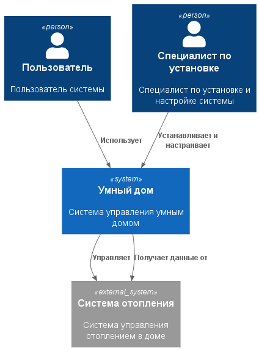
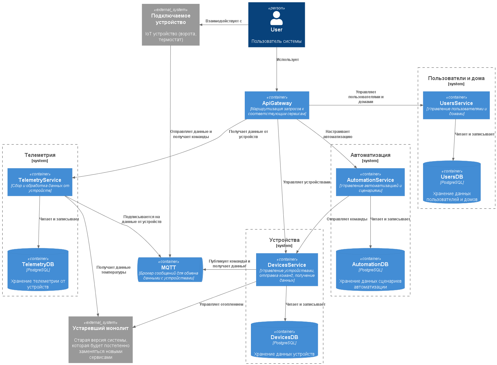
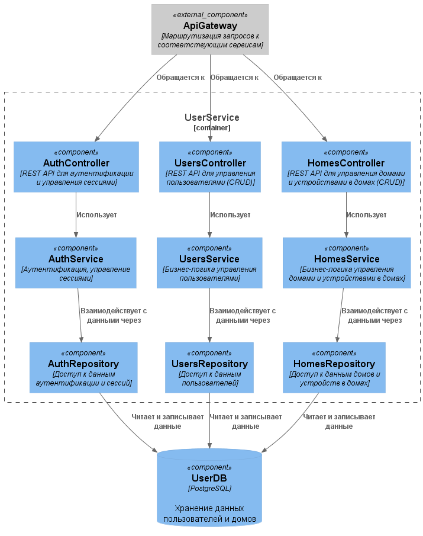
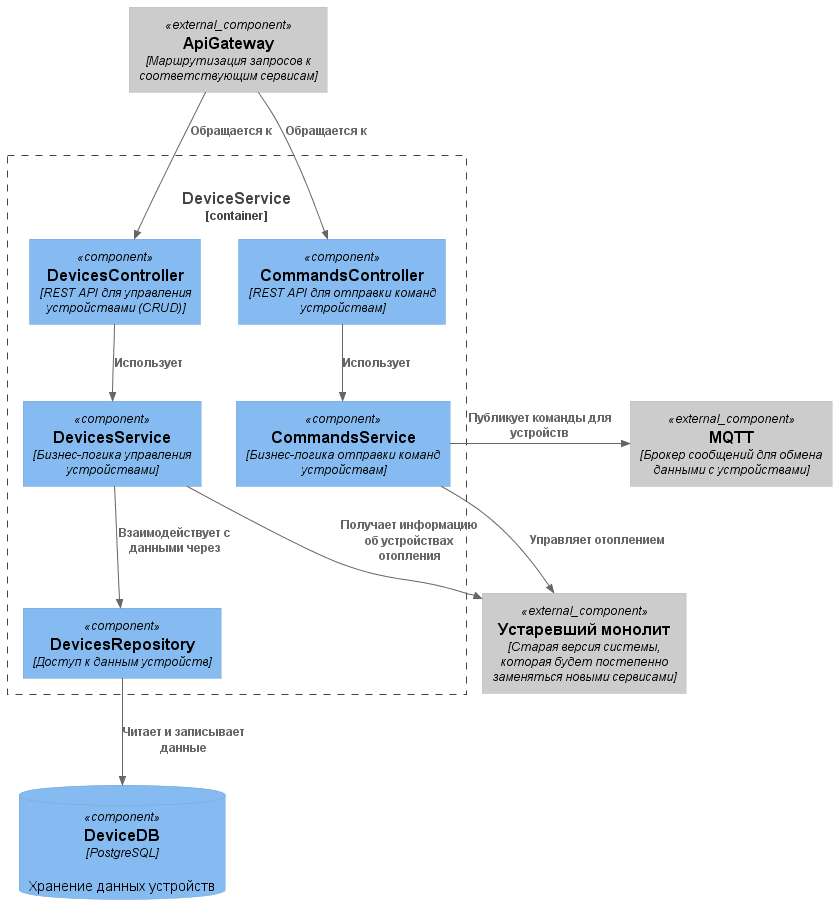
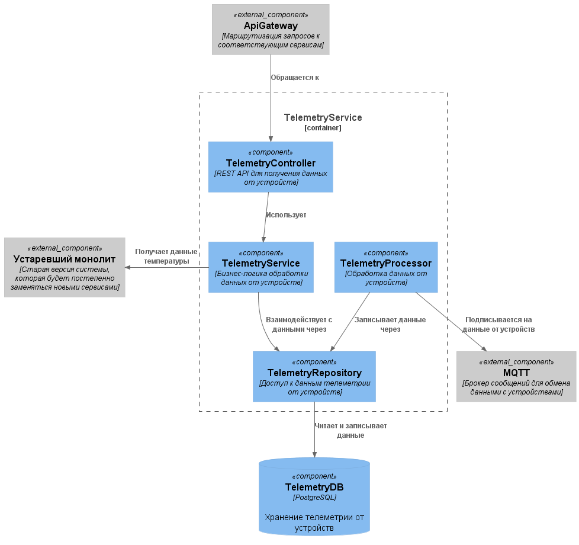
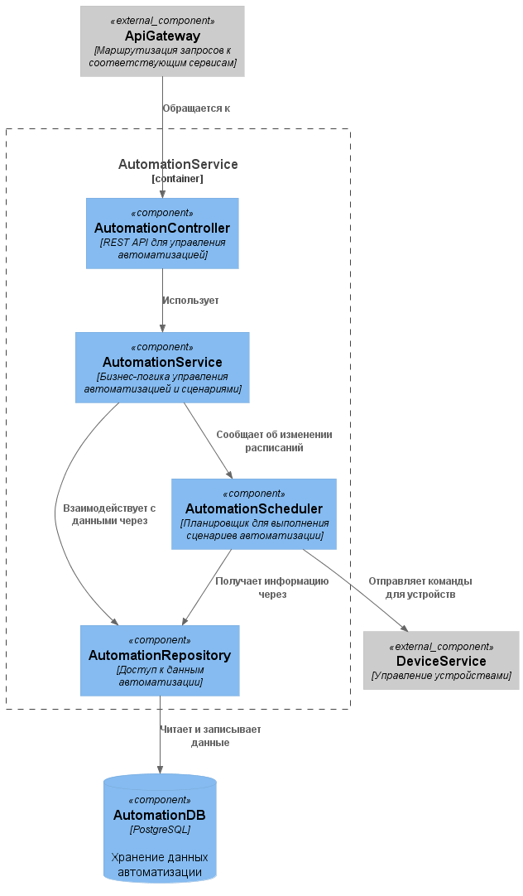
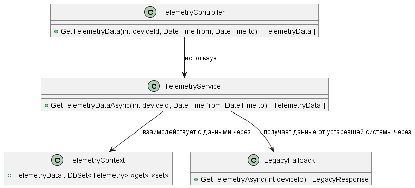
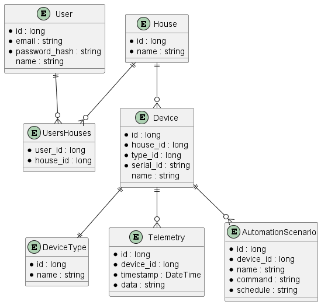

# Задание 1. Анализ и планирование

### 1. Описание функциональности монолитного приложения

**Управление отоплением:**

- Пользователи могут удалённо включать/выключать отопление в своих домах.
- Система поддерживает добавление новых устройств техническим специалистом.

**Мониторинг температуры:**

- Пользователи могут просматривать текущую температуру в своих домах через веб-интерфейс.
- Система получает данные о температуре с датчиков, установленных в домах.

### 2. Анализ архитектуры монолитного приложения

- __Язык программирования__: Go
- __База данных__: PostgreSQL
- __Архитектура__: Монолитная, все функции и компоненты находятся в одном приложении.
- __Взаимодействие__: Синхронное, запросы обрабатываются последовательно.
- __Масштабируемость__: Ограничена, так как монолит сложно масштабировать по частям.
- __Развертывание__: Требует остановки всего приложения.

### 3. Определение доменов и границы контекстов

- Домен: Добавление устройств:
    - Контекст: Регистрация новых систем отопления.
- Домен: Управление устройствами:
	- Контекст: Включение/выключение отопления.
- Домен: Мониторинг устройств:
	- Контекст: Получение данных о температуре с датчиков.

### **4. Проблемы монолитного решения**

- __Слабая масштабируемость__: невозможно провести масштабирование отдельных компонентов приложения при неравномерном росте нагрузки.
- __Низкая изоляция изменений__: любая доработка логики, добавление новых функций и т.д. требует повторного тестирования всего приложения.
- __Повышенные риски при обновлении__: ошибка в одном компоненте может повлиять на весь монолит и привести к недоступности всей системы.
- __Сложность сопровождения__: с ростом кода увеличивается связность компонентов, усложняются поддержка, рефакторинг и onboarding новых разработчиков.

Переход на микросервисную архитектуру позволяет выделить отдельные домены в независимые сервисы, масштабировать их отдельно, уменьшить связанность и повысить устойчивость системы.

### 5. Визуализация контекста системы — диаграмма С4



# Задание 2. Проектирование микросервисной архитектуры

**Диаграмма контейнеров (Containers)**



**Диаграмма компонентов (Components)**

UserService



DeviceService



TelemetryService



AutomationService



**Диаграмма кода (Code)**

TelemetryService



# Задание 3. Разработка ER-диаграммы



# Задание 4. Создание и документирование API

### 1. Тип API

Внешний API (gateway) будет использовать REST для взаимодействия с клиентами, т.к. он обеспечивает простоту и широкую поддержку.

Для общения между микросервисами следует использовать gRPC (т.к. он обеспечивает более высокую производительность), но на текущем этапе будет использоваться REST.

Для взаимодействия с устройствами будет использоваться MQTT, т.к. он оптимизирован для работы с IoT и обеспечивает низкую задержку и надежную доставку сообщений.

### 2. Документация API

Здесь приложите ссылки на документацию API для микросервисов, которые вы спроектировали в первой части проектной работы. Для документирования используйте Swagger/OpenAPI или AsyncAPI.

# Задание 5. Работа с docker и docker-compose

Перейдите в apps.

Там находится приложение-монолит для работы с датчиками температуры. В README.md описано как запустить решение.

Вам нужно:

1) сделать простое приложение temperature-api на любом удобном для вас языке программирования, которое при запросе /temperature?location= будет отдавать рандомное значение температуры.

Locations - название комнаты, sensorId - идентификатор названия комнаты

```
	// If no location is provided, use a default based on sensor ID
	if location == "" {
		switch sensorID {
		case "1":
			location = "Living Room"
		case "2":
			location = "Bedroom"
		case "3":
			location = "Kitchen"
		default:
			location = "Unknown"
		}
	}

	// If no sensor ID is provided, generate one based on location
	if sensorID == "" {
		switch location {
		case "Living Room":
			sensorID = "1"
		case "Bedroom":
			sensorID = "2"
		case "Kitchen":
			sensorID = "3"
		default:
			sensorID = "0"
		}
	}
```

2) Приложение следует упаковать в Docker и добавить в docker-compose. Порт по умолчанию должен быть 8081

3) Кроме того для smart_home приложения требуется база данных - добавьте в docker-compose файл настройки для запуска postgres с указанием скрипта инициализации ./smart_home/init.sql

Для проверки можно использовать Postman коллекцию smarthome-api.postman_collection.json и вызвать:

- Create Sensor
- Get All Sensors

Должно при каждом вызове отображаться разное значение температуры

Ревьюер будет проверять точно так же.


# **Задание 6. Разработка MVP**

Необходимо создать новые микросервисы и обеспечить их интеграции с существующим монолитом для плавного перехода к микросервисной архитектуре. 

### **Что нужно сделать**

1. Создайте новые микросервисы для управления телеметрией и устройствами (с простейшей логикой), которые будут интегрированы с существующим монолитным приложением. Каждый микросервис на своем ООП языке.
2. Обеспечьте взаимодействие между микросервисами и монолитом (при желании с помощью брокера сообщений), чтобы постепенно перенести функциональность из монолита в микросервисы. 

В результате у вас должны быть созданы Dockerfiles и docker-compose для запуска микросервисов. 